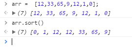
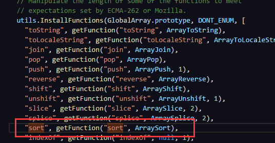
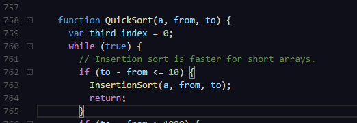
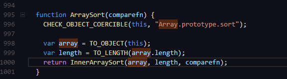
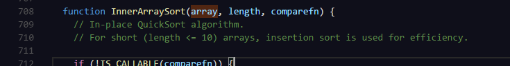

* content
{:toc}
我在游戏开发中，直接使用sort对数据进行排序，比如物品，常根据类型和品质进行排序，但是发现，排序的结果一直在变化，比如在不改变数据的情况下，第一次登录跟第二次登陆背包物品的顺序是不一致的，百般测试对比方法，不得其解，遂对sort进行研究。


在JS中只需要使用array.sort()就也可排序，例如
```
var arr = [12,33,65,90,12,1,0];
arr.sort();
结果：[0, 1, 12, 12, 33, 65, 90]
function compare(var a,var b){
    return a < b ? 1: -1;
}
arr.sort(compare);
```
结果：[90, 65, 33, 12, 12, 1, 0]  
注意的是，无参数的sort()是讲数组转换为字符进行对比，结果是12< 9
  
知其然也要知其所以然，在使用sort的时候，常常遇到坑，原本有序的比如obj1.key == obj2.key 时，obj1跟obj2的顺序不稳定。对此，需要从源码入手，查看sort是怎么实现的。
附源码：  
 [array.js](images/js-sort/array.js)    
我们可以看到，sort是通过ArraySort 实现的  
    
再深入查看看  
     
    
    

 我们可以看到，最终使用的是快速排序算法，数组长度小于等于10时，我们看到采用的是插入排序算法，快速排序算法是不稳定算法，也就是说，两个相同键值的记录，顺序会发生变化，而插入
排序算法是一种稳定算法，因此，在我们想保持同值有序的时候，我们需要自己创建个稳定排序算法

 

 