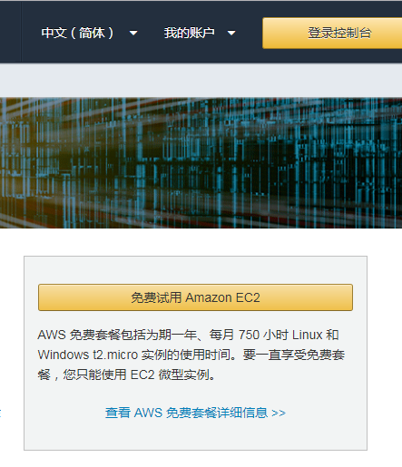
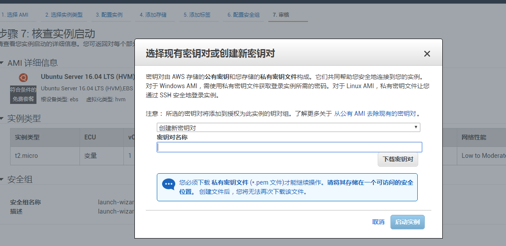

##  使用AWS-EC2部署H5游戏
最近试了一下使用了AWS部署游戏,效果挺好，链接[game.wuhaisheng.cn](game.wuhaisheng.cn)  

### 关于AWS-EC2

[https://aws.amazon.com/cn/ec2/](https://aws.amazon.com/cn/ec2/)  
aws-ec2是Amazon 的云服务器 ，Amazon免费提供一年的Linux 或者Windows服务器使用，对于个人开发者来说是个很好的福利，虽然配置挺低的

###  创建EC2服务器实例
此处省略1W字注册登录选择免费服务   
...  ... 
1. 选择服务器类型 [链接](https://ap-southeast-1.console.aws.amazon.com/ec2/v2/home?region=ap-southeast-1#LaunchInstanceWizard:)
2. 直接默认走到下一步 
3. 创建"密钥对"， 

密钥对是用来通过ssh访问的主机 ，名称自己定，然后点击下载

